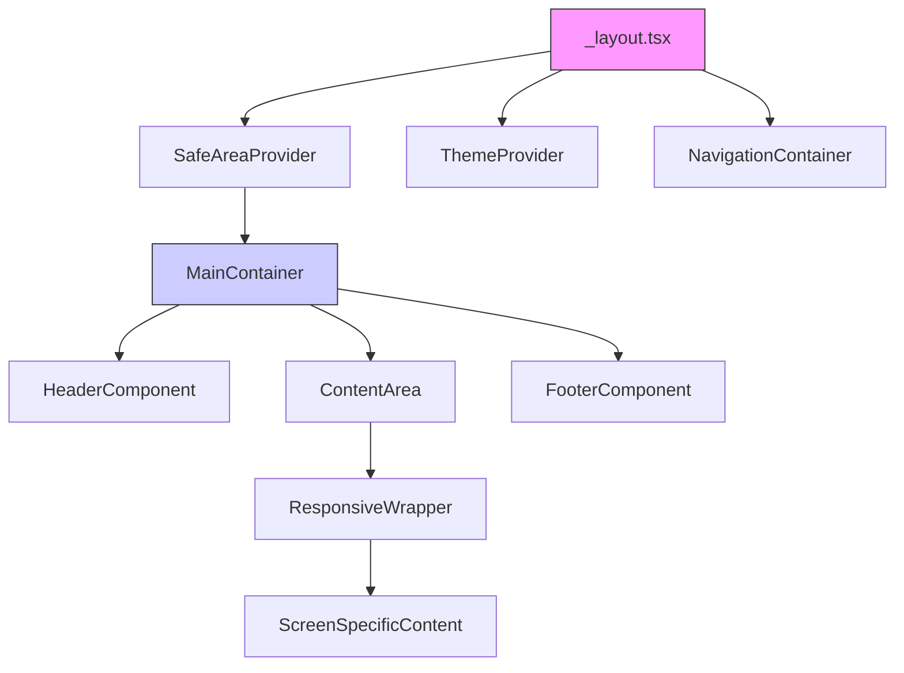

# Unified Layout Component Structure

```mermaid
graph TD
    RootLayout[_layout.tsx]
    RootLayout --> SafeAreaProvider[SafeAreaProvider]
    RootLayout --> ThemeProvider[ThemeProvider]
    RootLayout --> NavigationProvider[NavigationContainer]

    SafeAreaProvider --> MainContainer[MainContainer]

    MainContainer --> Header[HeaderComponent]
    MainContainer --> Content[ContentArea]
    MainContainer --> Footer[FooterComponent]

    Content --> ResponsiveWrapper[ResponsiveWrapper]
    ResponsiveWrapper --> ScreenContent[ScreenSpecificContent]

    style RootLayout fill:#f9f,stroke:#333
    style MainContainer fill:#ccf,stroke:#333
```
