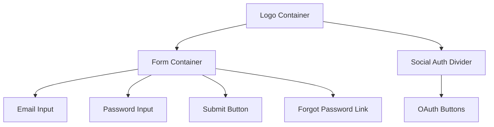

# Login Screen Design Proposal

## Available UI Components

✅ Existing React Native Reusable elements:

- **Input Fields**: `components/nativewindui/Text` (text input)
- **Buttons**: `components/nativewindui/Button`
- **Pickers**: `components/nativewindui/DatePicker`
- **Containers**: `components/Container.tsx`
- **Theme Toggle**: `components/ThemeToggle.tsx`

## Required Modules

⚠️ Needs installation:

```bash
npm install @react-native-community/datetimepicker
npm install @react-native-picker/picker
```

## Visual Hierarchy



## Layout Requirements

1. **Container Structure**

   ```tsx
   <View className="p-4 max-w-md w-full">
   ```

2. **Input Fields**

   ```tsx
   <Text className="h-12 rounded-lg border px-4 dark:border-gray-600" editable />
   ```

3. **Button Styles**
   ```tsx
   <Button
     className="h-12 rounded-lg bg-blue-600 dark:bg-blue-700"
     textClass="text-white font-medium"
   />
   ```

## Next Steps

1. Install native dependencies
2. Create layout preview component
